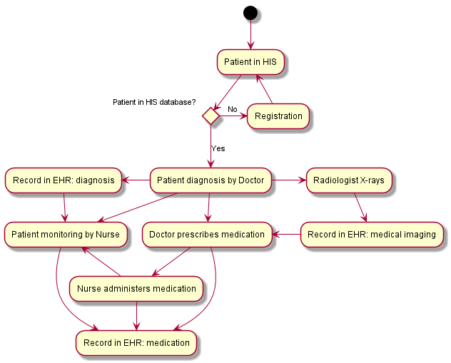
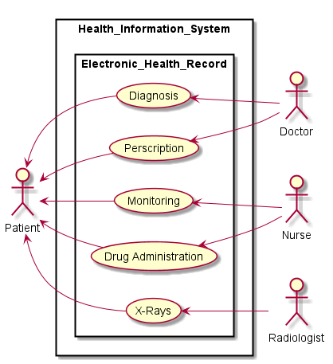
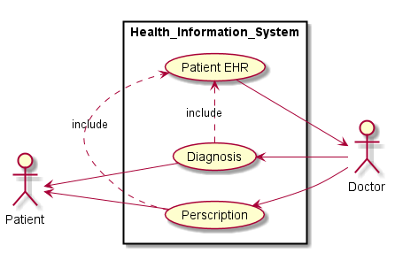
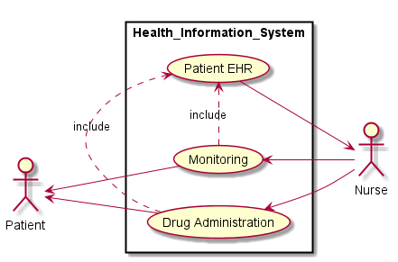
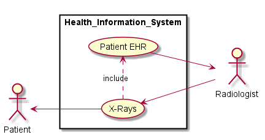

---
  title: "Assignment 1"
  author: "Giovanni Mostert"
  date: "13 March 2017"
...

# Section A

## Question 1
*Discuss the significance of good knowledge management in healthcare service delivery.*

 @elmorr2010 notes the complex nature of the healthcare services industry, with patients coming into contacts with a multitude of various individuals ranging from doctors and nurses, hospital administration staff and even pharmaceutical industry employees. Knowledge management systems can ease the operation and management of all this patient data, especially if the aforementioned actors are *geographically* dispersed. El Morr et all [-@elmorr2010] further note the use of Knowledge Management Systems in diminishing medical errors such as encountered by Dr. Griner. These systems aid and strengthen the medicine prescription protocols, and allow doctors and care-givers more oversight in patient care. Bordoloi and Islam [-@bordoloi2012], Guptill [-@guptill2005] and Wickramasinghe[-@wickramasinghe2007] provide a performance perspective and note that Knowledge Management systems can be seen to increase functional aspects of all facets of the healthcare industry. They also note the increase in technical skill of primary caregivers -- doctors, nurses and orderlies, etc., what they call "Evidence based medicine" [@bordoloi2012] due to the use of Knowledge Management frameworks and systems.

## Question 2
*One of the ways to reduce input errors is to educate staff. With relevance
 to the errors that occurred in the case, advise hospital management how staff
 education should be taking place.*

  Simulation training is an effective method of preparing, educating and simulating [@aggarwal2010] real-life scenarios where care-givers are expected to make snap decisions. Also, a possible strategy could be the *"buddy-system"* implemented in the hospital context, where care givers (nurses as well as doctor) are shadowed by junior medical staff that monitor and learn from their more experienced colleagues. This results in a *win-win* scenario where hospitals can train new staff while instilling vigilance in healthcare service delivery.

## Question 3
*Briefly discuss how the two medical errors that occurred can lead to the hospital's financial losses.*

  Medical misconduct of malpractice can trigger legal action by the victims and lead to penalties, fees and damages payable by the hospital. These amounts are usually large figures (millions) and could be ruinous for a hospital. Another, albeit slower financial impact could be felt from the lack of trust in a hospital experienced by patients. If the public no longer has faith in a hospital or its practice of medicine, a hospital could suffer since it still has to pay salaries of staff and cover the cost of medicines and instruments. Lastly, top doctors and surgeons, wary of the negative publicity could leave for other hospitals causing further harm.

## Question 4
*Discuss the strategies that should be put in place to ensure data accurate for this hospital.*

   The significance of data integrity in the healthcare industry should not be underestimated, and as such the following strategies should be implemented to ensure robust medical data integrity [@barnard2013], [@arrowood2013]:
   - medical quality and safety systems needs to be an accountability of management, and as such should be a priority in hospital management. The attitude of management is often a great predictor of the success of accountability strategies. In the case of the unnamed hospital in New York, hospital management was clearly more focused on keeping secret any medical quality irregularity, and this attitude has permeated down the ranks of hospital staff and has thus created a context of opacity regarding data integrity.
   - adequate safety and support infrastructure for those who report quality and safety issues. By providing support infrastructure and a transparent environment, health staff are more likely to report data integrity breaches.
   - training of staff and documentation of training ensures that data integrity is constantly enforced. The literature Arrowood et al [-@arrowood2013] suggest yearly training to refresh the concept of integrity in staff. Furthermore, documentation of training allows quick reference in edge-cases (use cases not covered in training).
   - in hospitals and healthcare centres that use systems and platforms that assist in monitoring, medical decision-making and support, it is important to assess the tools for proper functioning. Related to this is the assessment of the users that will use these support systems [@healthitanalytics2015].

## Question 5
*As an IT board member for this hospital, argue your case why the hospital should outsource its data storage. Explain to management how outsourcing will be done, outsourcing benefits, to the hospital in terms of reducing errors, data security and the challenges that can come with it.*

Data storage is a costly IT endeavour, with ComputerWeekly estimating nearly 50% of IT costs go towards hardware costs related to storage [@compweekly]. Also, IT infrastructure and management is not the purview of hospitals, and as such hospitals do not give proper priority towards IT, often regarding it as an afterthought (if not neglected, due to budgetary concerns among other). Thus hospital IT equipment is often grossly under-equipped, old or obsolete. IT staff at hospitals also might not be adequately trained to handle sensitive medical data, or due to low budgets might not get training in IT management. Furthermore, cost is an important consideration

# Section B

## Question 6
*Design a computer healthcare system that will enable the hospital to execute processes as defined by the doctor. Consider all the actors that are needed to fulfil the scenario. Note: database component should be included in the
system design.*

### System flow chart.

 \vspace*{0.5 cm}

### System use case diagrams.
The following use case diagrams describe the use cases of the type described by Dr. Griner.

The first use case shows the overall interaction between actors and how their use cases are involved in a Patient's Electronic Health record, which is a part of the larger hospital Health Information System.
{ width=80% }
 \vspace*{2 cm}

\newpage
Now we look in more detail of the interaction between Patient and Doctor. A doctor performs diagnosis on a Patient, with this information being captured in the Patient EHR. After diagnosis, prescription of medication takes place, of which is recorded in the Patient EHR.
{ width=85% }
 \vspace*{1.5 cm}

Nurses monitor Patient health vitals, and this information is added to the EHR of the Patient. Similarly, drug administration (which includes information contained in the EHR from the prescription phase such as medication type, dosage, etc) is performed and recorded.
{ width=90% }

\newpage
Based on Doctor recommendations, a Patient can be referred to a Radiologist to make X-rays for further diagnosis by the Doctor. This information is the stored in the Patient EHR, and accessible via the hospital HIS. From here the Doctor can easily access the X-ray data to further improve his/her original diagnosis.
{ width=85% }

\newpage
# Bibliography
